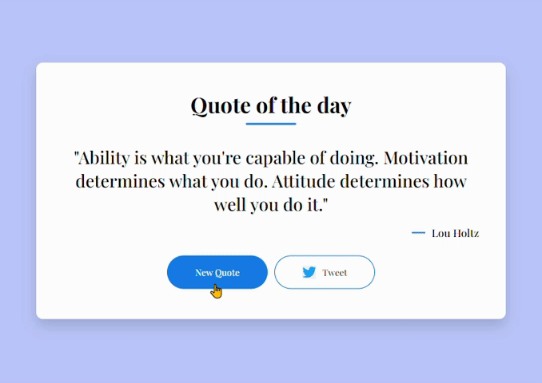

# Quote of the Day 📜

## Overview
"Quote of the Day" is a simple web application that displays a random quote along with its author. Users can get a new quote with the click of a button and also share their favorite quotes on Twitter.

### Technologies Used 🚀
- HTML
- CSS
- JavaScript

## Usage 💬
1. Get Inspired:
    - Open the index.html file in your preferred web browser.
    - Experience an instant uplift as the initial quote and author gracefully appear.
2. Discover More:
    - Click the "New Quote" button to explore a new, thought-provoking quote at any time.
3. Share the Wisdom:
    - Click the "Tweet" button to effortlessly share your favorite quotes on Twitter.

## Features ✨
- Random Quotes: Enjoy a diverse selection of quotes with each button click.
- Twitter Integration: Share your favorite quotes seamlessly on Twitter.

    

## Installation
No special installation is required for this project. Simply download the project files and open the index.html file in a web browser.

## API Information 🔗
This project uses the [Quotable API](https://github.com/lukePeavey/quotable) to fetch random quotes. The API provides a variety of endpoints for accessing quotes.

## Live Demo 🌐
Live Demo : 

## Contributing 🎯
Feel free to use and customize the project! If you have any questions or feedback, you can reach me at nisagokdemir@gmail.com. Enjoy!

### License
This project is licensed under the MIT License.